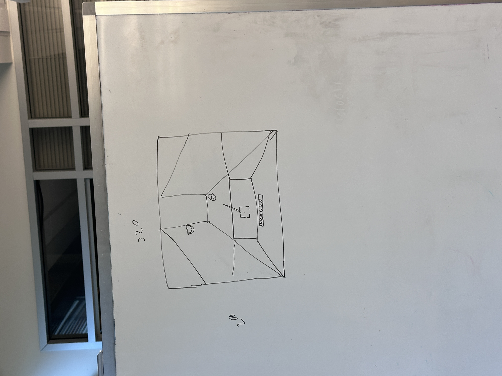
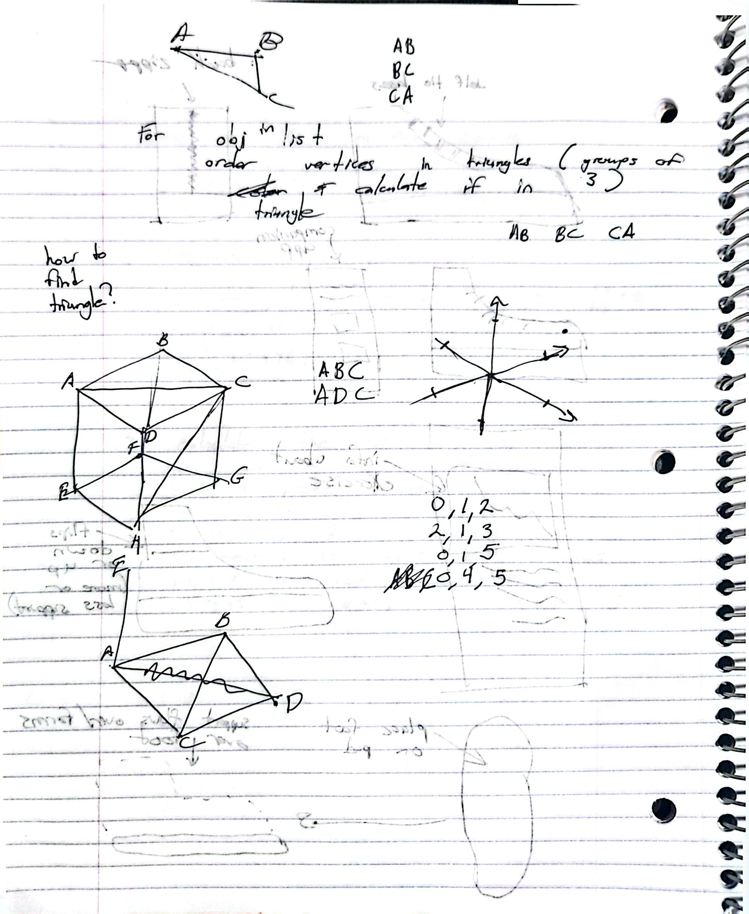
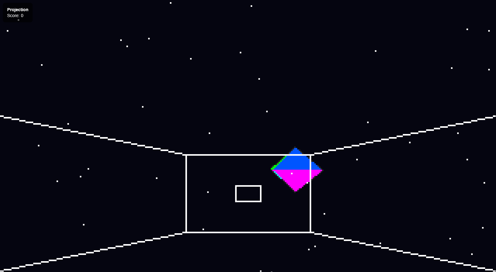
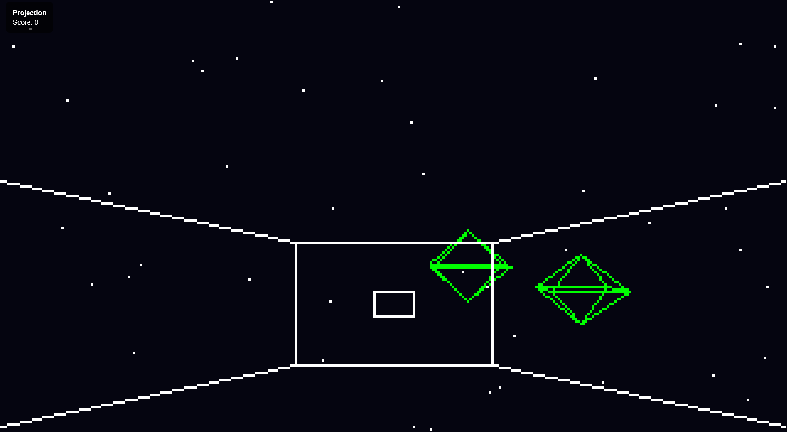

### Computer Graphics Project 1 Documentation
# By Ryan Sippy & Jason Bellerjeau

## Project Overview
[Here](https://sippyr.github.io/ComputerGraphics/Project1.html) is the link to the project, and [Here](https://github.com/SippyR/ComputerGraphics/blob/main/Project1.html) is the link to the GitHub repository for the project.

The goal of this project was to create a simple 3D graphics application that utilizes basic rendering techniques to display a 3D scene in the form of a game.  The project was implemented in an HTML webpage using simple JavaScript.  The project allows users to move objects in a 3D environment, and interact with them using basic controls.  The project showcases fundamental concepts of computer graphics, including 3D transformations, rasterization, and camera projection.

## Project Design Plan
Our project was initially designed to be a trench run game, where the player would be consantly moving through a trench and would have to aim and shoot at targets. A whiteboard sketch of our initial design is shown below. Along with some notes on the design, and how we planned to implement the cube objects and rasterization of the scene.

However, throughout the development process, we decided against the trench run aspect of the game, and instead focused on creating a space shooter game where the player can move objects in a 3D environment and shoot at targets. The final design of the project in both rasterized and wireframe formats is shown below.

## Project Details

## Implementation

## Future Work

## Demo Video
